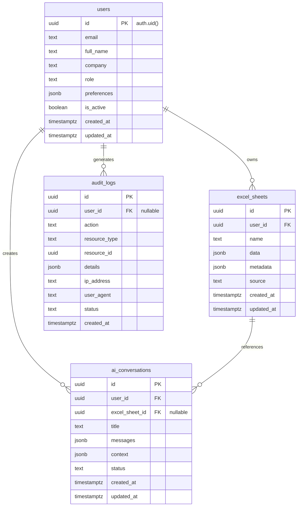

# FastAPI + Supabase Backend Implementation Plan - Excel AI Agent

## Overview
Build a secure, enterprise-grade FastAPI backend for the Excel AI Agent with Supabase PostgreSQL database, Supabase Auth authentication, real-time features, and Claude AI integration.

## 🗄️ DATABASE DESIGN & ARCHITECTURE

### **Supabase Database Schema (PostgreSQL)**

Our Excel AI Agent uses a **4-table relational design** in Supabase PostgreSQL with comprehensive Row Level Security (RLS) policies for enterprise-grade security.

#### **Table 1: `users` (User Profiles & Settings)**
```sql
-- Primary user profile table linked to Supabase Auth
CREATE TABLE public.users (
    id UUID PRIMARY KEY DEFAULT auth.uid(),           -- Links to Supabase Auth
    email TEXT NOT NULL,                              -- User email address
    full_name TEXT,                                   -- User's full name
    company TEXT,                                     -- Company/organization
    role TEXT NOT NULL DEFAULT 'user',               -- user, admin, super_admin
    preferences JSONB NOT NULL DEFAULT '{}',         -- Excel add-in settings
    is_active BOOLEAN NOT NULL DEFAULT true,         -- Account status
    created_at TIMESTAMPTZ NOT NULL DEFAULT now(),   -- Registration time
    updated_at TIMESTAMPTZ NOT NULL DEFAULT now()    -- Last profile update
);
```

**RLS Policies:**
- ✅ **Users can view own profile**: `auth.uid() = id` (SELECT)
- ✅ **Users can update own profile**: `auth.uid() = id` (UPDATE)
- ✅ **Users can insert own profile**: `auth.uid() = id` (INSERT)
- ✅ **No profile deletion**: Denied for data integrity

#### **Table 2: `excel_sheets` (Excel Workbook Data)**
```sql
-- Stores Excel workbook data and metadata for AI processing
CREATE TABLE public.excel_sheets (
    id UUID PRIMARY KEY DEFAULT uuid_generate_v4(),
    user_id UUID NOT NULL REFERENCES public.users(id) ON DELETE CASCADE ON UPDATE CASCADE,
    name TEXT NOT NULL,                               -- Sheet/workbook name
    data JSONB NOT NULL DEFAULT '{}',                 -- Excel data as JSON
    metadata JSONB NOT NULL DEFAULT '{}',             -- Size, columns, etc.
    source TEXT NOT NULL DEFAULT 'excel_addin',       -- Data source
    created_at TIMESTAMPTZ NOT NULL DEFAULT now(),
    updated_at TIMESTAMPTZ NOT NULL DEFAULT now()
);
```

**RLS Policies:**
- ✅ **Users can view own sheets**: `auth.uid() = user_id` (SELECT)
- ✅ **Users can insert own sheets**: `auth.uid() = user_id` (INSERT)
- ✅ **Users can update own sheets**: `auth.uid() = user_id` (UPDATE)
- ✅ **Users can delete own sheets**: `auth.uid() = user_id` (DELETE)

#### **Table 3: `ai_conversations` (Claude AI Chat History)**
```sql
-- Stores chat conversations with Claude AI for context and history
CREATE TABLE public.ai_conversations (
    id UUID PRIMARY KEY DEFAULT uuid_generate_v4(),
    user_id UUID NOT NULL REFERENCES public.users(id) ON DELETE CASCADE ON UPDATE CASCADE,
    excel_sheet_id UUID REFERENCES public.excel_sheets(id) ON DELETE SET NULL ON UPDATE CASCADE,
    title TEXT NOT NULL DEFAULT 'New Conversation',   -- Conversation title
    messages JSONB NOT NULL DEFAULT '[]',             -- Array of chat messages
    context JSONB NOT NULL DEFAULT '{}',              -- AI context and metadata
    status TEXT NOT NULL DEFAULT 'active',            -- active, archived, deleted
    created_at TIMESTAMPTZ NOT NULL DEFAULT now(),
    updated_at TIMESTAMPTZ NOT NULL DEFAULT now()     -- Last message time
);
```

**RLS Policies:**
- ✅ **Users can view own conversations**: `auth.uid() = user_id` (SELECT)
- ✅ **Users can insert own conversations**: `auth.uid() = user_id` (INSERT)
- ✅ **Users can update own conversations**: `auth.uid() = user_id` (UPDATE)
- ✅ **Users can delete own conversations**: `auth.uid() = user_id` (DELETE)

#### **Table 4: `audit_logs` (Compliance & Security Monitoring)**
```sql
-- Comprehensive audit logging for compliance and security monitoring
CREATE TABLE public.audit_logs (
    id UUID PRIMARY KEY DEFAULT uuid_generate_v4(),
    user_id UUID REFERENCES public.users(id) ON DELETE SET NULL ON UPDATE CASCADE, -- Nullable for system events
    action TEXT NOT NULL,                             -- ai_query, login, data_export, etc.
    resource_type TEXT,                               -- excel_sheet, conversation, user
    resource_id UUID,                                 -- ID of affected resource
    details JSONB NOT NULL DEFAULT '{}',             -- Full event details
    ip_address TEXT,                                  -- User's IP address
    user_agent TEXT,                                  -- Browser/client info
    status TEXT NOT NULL DEFAULT 'success',          -- success, failure, error
    created_at TIMESTAMPTZ NOT NULL DEFAULT now()    -- Event timestamp
);
```

**RLS Policies:**
- ✅ **Users can view own audit logs**: `auth.uid() = user_id` (SELECT)
- ✅ **Admins can view all audit logs**: `(auth.jwt() ->> 'role') = 'super_admin'` (SELECT)
- ✅ **System can insert audit logs**: `true` (INSERT for authenticated/anon)
- ✅ **No audit modifications**: Denied (UPDATE/DELETE) for audit integrity

### **Database Relationships & Foreign Keys**



### **Security Architecture**

#### **Row Level Security (RLS) Implementation**
- **User Isolation**: Users can only access their own data via `auth.uid() = user_id`
- **Admin Override**: Super admins can access all audit logs for compliance
- **Cascade Deletion**: User deletion automatically cleans up all related data
- **Audit Integrity**: Audit logs cannot be modified once created

#### **Foreign Key Constraints**
- **CASCADE on DELETE**: User deletion removes all their excel_sheets and ai_conversations
- **CASCADE on UPDATE**: ID changes propagate automatically
- **SET NULL on DELETE**: Audit logs and conversations preserve references even after resource deletion

#### **Data Types & Indexing**
- **JSONB**: Efficient storage and querying of Excel data, AI messages, and metadata
- **UUIDs**: Secure, non-sequential primary keys
- **Timestamps**: Full timezone support for global deployment
- **Indexes**: Automatic indexing on foreign keys and common query patterns

### **Data Flow Examples**

#### **User Registration Flow**
```sql
-- 1. Supabase Auth creates user
-- 2. Trigger creates user profile
INSERT INTO public.users (id, email, full_name) 
VALUES (auth.uid(), 'user@company.com', 'John Doe');

-- 3. RLS automatically isolates user data
SELECT * FROM users WHERE auth.uid() = id; -- Only returns current user
```

#### **Excel Data Processing Flow**
```sql
-- 1. User uploads Excel data
INSERT INTO public.excel_sheets (user_id, name, data, metadata)
VALUES (auth.uid(), 'Q3 Revenue', '{"rows": [...]}', '{"columns": 5}');

-- 2. AI conversation created
INSERT INTO public.ai_conversations (user_id, excel_sheet_id, title)
VALUES (auth.uid(), $excel_sheet_id, 'Revenue Analysis');

-- 3. Audit log created automatically
INSERT INTO public.audit_logs (user_id, action, resource_type, resource_id, details)
VALUES (auth.uid(), 'excel_upload', 'excel_sheet', $excel_sheet_id, '{"size": "1.2MB"}');
```

#### **Multi-User Collaboration (Future)**
- **Company-level RLS**: Extend policies to allow team access
- **Shared Sheets**: Additional permissions table for sheet sharing
- **Role Hierarchy**: Admin > Manager > User permission levels

This database design provides **enterprise-grade security**, **audit compliance**, **scalable performance**, and **clean data relationships** for the Excel AI Agent platform.

## Phase 1: Foundation & Core Setup (Week 1)

### Task 1.1: Project Structure & Poetry Setup ✅ COMPLETED
**Goal**: Create enterprise-grade Python project structure with Poetry dependency management
**Reasoning**: Proper project organization from the start prevents technical debt and ensures maintainability

**Implementation Steps**: ✅ ALL COMPLETED
1. ✅ Initialize Poetry project in `backend/` directory
2. ✅ Configure `pyproject.toml` with all dependencies and metadata
3. ✅ Create module-based project structure (not file-type based)
4. ✅ Set up environment configuration with Pydantic Settings
5. ✅ Create initial directory structure with proper `__init__.py` files

**Project Structure**:
```
backend/
├── pyproject.toml              # Poetry configuration and dependencies
├── README.md                   # Backend-specific documentation
├── .env.example               # Environment variables template
├── .env                       # Local environment (git-ignored)
├── alembic.ini               # Database migration configuration
├── app/
│   ├── __init__.py
│   ├── main.py               # FastAPI application entry point
│   ├── config/
│   │   ├── __init__.py
│   │   ├── settings.py       # Pydantic Settings configuration
│   │   └── database.py       # Database connection setup
│   ├── auth/
│   │   ├── __init__.py
│   │   ├── azure_ad.py       # Azure AD integration
│   │   ├── jwt_handler.py    # JWT token validation
│   │   └── dependencies.py   # Authentication dependencies
│   ├── models/
│   │   ├── __init__.py
│   │   ├── base.py          # SQLAlchemy base model
│   │   ├── user.py          # User model
│   │   ├── audit.py         # Audit logging model
│   │   └── permissions.py   # Access control models
│   ├── schemas/
│   │   ├── __init__.py
│   │   ├── user.py          # User Pydantic schemas
│   │   ├── auth.py          # Authentication schemas
│   │   └── audit.py         # Audit log schemas
│   ├── api/
│   │   ├── __init__.py
│   │   ├── deps.py          # API dependencies
│   │   └── v1/
│   │       ├── __init__.py
│   │       ├── router.py    # Main API router
│   │       ├── auth.py      # Authentication endpoints
│   │       ├── users.py     # User management endpoints
│   │       └── health.py    # Health check endpoint
│   ├── services/
│   │   ├── __init__.py
│   │   ├── auth_service.py  # Authentication business logic
│   │   ├── audit_service.py # Audit logging service
│   │   └── ai_service.py    # Claude AI integration
│   ├── middleware/
│   │   ├── __init__.py
│   │   ├── cors.py          # CORS configuration for Excel
│   │   ├── security.py      # Security headers
│   │   └── audit.py         # Audit logging middleware
│   └── utils/
│       ├── __init__.py
│       ├── logger.py        # Structured logging
│       └── security.py      # Security utilities
├── migrations/              # Alembic database migrations
│   └── versions/
└── tests/
    ├── __init__.py
    ├── conftest.py         # Pytest configuration
    ├── test_auth.py        # Authentication tests
    └── test_api.py         # API endpoint tests
```

**Dependencies (pyproject.toml)**:
```toml
[tool.poetry]
name = "excel-ai-agent-backend"
version = "0.1.0"
description = "Secure FastAPI backend for Excel AI Agent"
authors = ["Your Name <your.email@example.com>"]

[tool.poetry.dependencies]
python = ">=3.13"
# Core FastAPI
fastapi = "^0.104.0"
uvicorn = {extras = ["standard"], version = "^0.24.0"}
# Database
sqlalchemy = "^2.0.23"
alembic = "^1.12.1"
asyncpg = "^0.29.0"        # PostgreSQL async driver
aiosqlite = "^0.19.0"      # SQLite async driver
# Authentication & Security
python-jose = {extras = ["cryptography"], version = "^3.3.0"}
passlib = {extras = ["bcrypt"], version = "^1.7.4"}
python-multipart = "^0.0.6"
# Azure AD integration
azure-identity = "^1.15.0"
msal = "^1.26.0"
# AI Integration
anthropic = "^0.8.0"
# Configuration & Environment
pydantic = {extras = ["email"], version = "^2.5.0"}
pydantic-settings = "^2.1.0"
python-dotenv = "^1.0.0"
# HTTP & CORS
httpx = "^0.25.2"
# Utilities
loguru = "^0.7.2"

[tool.poetry.group.dev.dependencies]
pytest = "^7.4.3"
pytest-asyncio = "^0.21.1"
httpx = "^0.25.2"
black = "^23.11.0"
isort = "^5.12.0"
mypy = "^1.7.1"
ruff = "^0.1.6"
```

### Task 1.2: Supabase Setup & Configuration ✅ COMPLETED
**Goal**: Set up Supabase project with PostgreSQL database and authentication
**Reasoning**: Supabase provides enterprise-grade PostgreSQL with built-in auth, real-time features, and Row Level Security

**Implementation Steps**: ✅ ALL COMPLETED
1. ✅ Create Supabase project and obtain connection credentials
2. ✅ Set up Supabase client configuration in FastAPI
3. ✅ Configure Row Level Security (RLS) policies for data access control
4. ✅ Create base database schema with audit trails and user management
5. ✅ Test Supabase connection and basic operations

### Task 1.3: Environment Configuration ✅ COMPLETED
**Goal**: Secure environment variable management with Pydantic Settings
**Reasoning**: Type-safe configuration prevents deployment errors and secures sensitive data

**Implementation Steps**: ✅ ALL COMPLETED
1. ✅ Create `Settings` class with `SecretStr` for sensitive data
2. ✅ Configure environment-specific settings (dev, staging, prod)
3. ✅ Add Supabase URL and API key configuration
4. ✅ Set up Supabase service role key for admin operations
5. ✅ Create `.env.example` template with Supabase credentials

### Task 1.4: FastAPI Main Application ✅ COMPLETED **NEW**
**Goal**: Create FastAPI application with health checks and CORS configuration
**Reasoning**: Proper FastAPI setup with Excel add-in communication and monitoring capabilities

**Implementation Steps**: ✅ ALL COMPLETED
1. ✅ Create `main.py` with FastAPI application initialization
2. ✅ Configure CORS middleware for Excel add-in origins
3. ✅ Implement basic health check endpoint (`/health`)
4. ✅ Implement Supabase health check endpoint (`/health/supabase`)
5. ✅ Test FastAPI server with uvicorn and verify endpoints

**Technical Issues Resolved**:
- ✅ Fixed Python version compatibility (`>=3.13,<4.0`)
- ✅ Updated Pydantic v2 imports (`pydantic_settings`)
- ✅ Fixed Supabase client `ClientOptions` parameters
- ✅ Resolved database query permissions for health checks

## Phase 2: Authentication & Security (Week 2)

### Task 2.1: Supabase Authentication Integration
**Goal**: Secure user authentication using Supabase Auth with JWT tokens
**Reasoning**: Supabase Auth provides enterprise-grade authentication with built-in JWT handling and user management

**Implementation Steps**:
1. Configure Supabase Auth settings and providers
2. Implement Supabase JWT token validation in FastAPI
3. Create user session management with Supabase
4. Add role-based access control using Supabase Auth
5. Test authentication flow with Excel add-in

### Task 2.2: Row Level Security (RLS) Implementation  
**Goal**: Database-level access control using Supabase RLS policies
**Reasoning**: More secure than application-level permissions, built into PostgreSQL

**Implementation Steps**:
1. Create RLS policies for user data isolation
2. Implement sheet-level and column-level access controls
3. Add audit trail policies for compliance
4. Create admin override policies for system operations
5. Test RLS policies with different user roles

### Task 2.3: CORS Configuration for Excel
**Goal**: Proper cross-origin configuration for Office add-ins
**Reasoning**: Excel add-ins have specific CORS requirements that must be met

**Critical CORS Requirements**:
```python
ALLOWED_ORIGINS = [
    "https://excel.office.com",           # Excel on the web
    "https://excel.officeapps.live.com",  # Excel online
    "https://localhost:3000",             # Development (HTTPS only)
    "https://127.0.0.1:3000"             # Alternative localhost
]

ALLOWED_METHODS = ["GET", "POST", "PUT", "DELETE", "OPTIONS"]
ALLOWED_HEADERS = [
    "Authorization",
    "Content-Type", 
    "X-Requested-With",
    "X-Office-Version",     # Office version headers
    "X-Excel-SessionId",    # Excel session tracking
    "apikey"               # Supabase API key header
]
```

## Phase 3: AI Integration & Business Logic (Week 3)

### Task 3.1: Claude AI Service
**Goal**: Anthropic Claude integration for intelligent Excel assistance
**Reasoning**: Claude excels at data analysis and structured tasks perfect for finance use cases

**Implementation Steps**:
1. Create AI service wrapper for Anthropic SDK
2. Implement conversation context management
3. Add prompt engineering for Excel-specific tasks
4. Handle rate limiting and error recovery
5. Add usage tracking and cost monitoring

### Task 3.2: Audit Logging System with Supabase
**Goal**: Comprehensive logging of all AI interactions using Supabase database
**Reasoning**: Compliance requirement for enterprise finance teams, leveraging Supabase's built-in audit features

**Implementation Steps**:
1. Create audit log tables in Supabase with RLS policies
2. Implement audit middleware using Supabase client
3. Log AI prompts, responses, and user actions to Supabase
4. Add audit query endpoints using Supabase queries
5. Configure Supabase-based log retention and archival

### Task 3.3: Supabase Realtime Integration
**Goal**: Real-time updates for collaborative Excel features
**Reasoning**: Enable live collaboration and instant AI response updates

**Implementation Steps**:
1. Configure Supabase Realtime channels for AI conversations
2. Implement real-time notifications for audit events
3. Add live progress updates for long-running AI operations
4. Create WebSocket integration with Excel SharedRuntime
5. Test real-time features with multiple users

## Phase 4: API Endpoints & Integration (Week 4)

### Task 4.1: Core API Endpoints
**Goal**: REST API for Excel add-in communication
**Reasoning**: Clean API interface for frontend integration

**Implementation Steps**:
1. Health check and system status endpoints
2. User authentication and profile endpoints
3. AI chat and conversation endpoints
4. Permission management endpoints
5. Audit log query endpoints

### Task 4.2: Excel Data Processing
**Goal**: Handle Excel data import and processing
**Reasoning**: Core functionality for data cleaning and AI analysis

**Implementation Steps**:
1. Excel range data parsing
2. Data validation and sanitization
3. Preview system before AI processing
4. Batch processing for large datasets
5. Error handling and user feedback

### Task 4.3: WebSocket Support (Optional)
**Goal**: Real-time communication for long-running tasks
**Reasoning**: Better user experience for AI processing that takes time

**Implementation Steps**:
1. Add WebSocket support to FastAPI
2. Implement connection management
3. Real-time progress updates
4. Connection cleanup and error handling
5. Integration with Excel SharedRuntime

## Week 5: Testing & Deployment Preparation

### Task 5.1: Comprehensive Testing
**Goal**: Full test coverage for reliability
**Implementation Steps**:
1. Unit tests for all services and utilities
2. Integration tests for API endpoints
3. Authentication flow testing
4. Database migration testing
5. Load testing for AI endpoints

### Task 5.2: Production Configuration
**Goal**: Production-ready deployment setup
**Implementation Steps**:
1. Docker containerization
2. Production environment configuration
3. Database connection pooling optimization
4. Logging and monitoring setup
5. Security hardening checklist

## Security Considerations

### **Office Add-in Specific Security**
1. **HTTPS Enforcement**: All Office add-ins must use HTTPS
2. **CORS Restrictions**: No wildcards allowed, specific domains only
3. **Content Security Policy**: Strict CSP headers for XSS prevention
4. **Token Security**: Never expose tokens to client-side code

### **Enterprise Finance Security**
1. **Audit Logging**: Every AI interaction logged with user context
2. **Data Encryption**: All sensitive data encrypted at rest and in transit
3. **Access Controls**: Granular permissions with principle of least privilege
4. **Rate Limiting**: Prevent abuse and control AI usage costs

### **Azure AD Integration**
1. **Server-Side Validation**: Never trust client-side tokens
2. **Role-Based Access**: Map Azure AD roles to application permissions
3. **Secure Token Storage**: Use secure, HTTP-only cookies when possible
4. **Token Refresh**: Implement proper token refresh flows

## Success Criteria

### **Phase 1 Success Criteria**:
- ✅ Poetry environment set up with all dependencies
- ✅ Database connections working (both PostgreSQL and SQLite)
- ✅ Environment configuration properly secured
- ✅ Project structure follows enterprise best practices

### **Phase 2 Success Criteria**:
- ✅ Azure AD authentication working
- ✅ JWT tokens generated and validated correctly
- ✅ CORS configured for Excel add-in access
- ✅ Security middleware protecting all endpoints

### **Phase 3 Success Criteria**:
- ✅ Claude AI integration responding to requests
- ✅ All AI interactions logged for audit
- ✅ Permission system enforcing access controls
- ✅ Usage tracking and cost monitoring active

### **Phase 4 Success Criteria**:
- ✅ All API endpoints documented and tested
- ✅ Excel data processing working end-to-end
- ✅ Error handling and user feedback implemented
- ✅ Integration with Excel add-in frontend complete

## Risk Mitigation

### **Technical Risks**:
- **CORS Issues**: Test with actual Excel environment early
- **Azure AD Changes**: Use stable Azure AD APIs and monitor deprecations
- **AI Token Costs**: Implement strict usage limits and monitoring
- **Database Performance**: Test with realistic data volumes

### **Security Risks**:
- **Token Exposure**: Implement secure token handling patterns
- **Data Leakage**: Audit all data access and transmission
- **Permission Bypass**: Test permission system thoroughly
- **XSS/CSRF**: Implement comprehensive security headers

## Monitoring & Observability

### **Application Monitoring**:
- Health check endpoints for uptime monitoring
- Structured logging with correlation IDs
- Performance metrics for AI response times
- Error tracking and alerting

### **Security Monitoring**:
- Failed authentication attempt tracking
- Unusual data access pattern detection
- AI usage anomaly detection
- Audit log integrity monitoring

## Next Immediate Steps

1. **Start with Task 1.1**: Initialize Poetry project and create directory structure
2. **Set up development environment**: Configure `.env` file and database connections
3. **Implement basic FastAPI app**: Create main.py with health check endpoint
4. **Test CORS configuration**: Ensure Excel add-in can communicate with backend

This plan emphasizes **enterprise-grade security** and **Microsoft Office integration** while maintaining **code quality** and **comprehensive testing** throughout the implementation process.